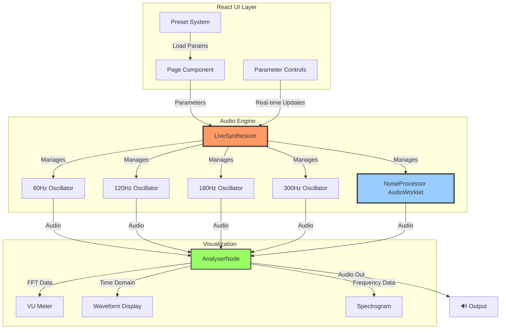

# ⚡ Blue Rose Signal - Stochastic Interference Spectrograph

A real-time audio synthesis web application that generates eerie, atmospheric electrical interference sounds using advanced DSP techniques. Features a vintage CRT monitor aesthetic inspired by Twin Peaks and Federal Bureau of Control technology.

## Current Version: Next.js Live Synthesis Engine

This project has evolved from a static Streamlit prototype to a sophisticated **real-time web audio synthesizer** built with Next.js 16 and the Web Audio API.

### Key Features

- **Real-Time Synthesis**: Live audio generation using Web Audio API and AudioWorkletProcessor
- **Stochastic DSP Engine**: Faithful recreation of the original Python algorithm
  - Gaussian noise generation via Box-Muller transform
  - Moving average envelope smoothing (convolution-based)
  - Binary threshold gating for stochastic on/off behavior
  - Friction-based spark generation (ungated for authentic breaking contact sounds)
- **60Hz Mains Hum + Harmonics**: Individual control over 60Hz, 120Hz, 180Hz, and 300Hz components
- **Advanced Audio Effects**:
  - **Voltage Starvation**: Audio envelope modulates CRT brightness at 375fps for synchronized visual flicker
  - **High-Voltage Arc Chain**: Parallel spectral processing (3kHz HPF + hard clipper) for electrical "snap" emphasis
  - **Ring Modulation**: Carrier oscillator creates inharmonic sidebands ("Ghost in the Radio" effect)
  - **Tape Wow/Flutter**: LFO-modulated delay simulates vintage tape pitch wobble (0-2ms, 1.5Hz)
  - **Tape Saturation**: Sigmoid waveshaping with 4x oversampling for warm analog-style soft clipping
- **Comprehensive Parameter Control**: 13 real-time adjustable parameters
  - Noise/Spark: Threshold, Smoothness, Spark Gain, Noise Level
  - Hum: 60Hz fundamental + 3 harmonics with independent gain
  - Ring Mod: Enable/Disable, Carrier Frequency (100-3000Hz)
  - Tape Effects: Wow/Flutter Depth, Saturation Amount
  - Global: Master Volume
- **Preset System**: 5 curated sonic profiles (Classic Hum, Heavy Crackle, Ethereal Drone, Unstable Signal, Deep Rumble)
- **Real-Time Visualization**: Waveform display, spectrogram, and VU meter
- **Vintage CRT Aesthetic**: Wood-grain TV cabinet with scanlines, phosphor glow, voltage starvation flicker, and retro styling
- **Fully Responsive**: Mobile-first design transforms between "Handheld Field Recorder" (mobile) and "Bureau Desk Terminal" (desktop) aesthetics

## Quick Start

```bash
cd blue-rose-signal-next
npm install
npm run dev
```

Open [http://localhost:3004](http://localhost:3004) in your browser.

## Architecture

### Technology Stack

- **Frontend**: Next.js 16.0.3 + React 19.2.0 + TypeScript 5.9.3
- **Styling**: Tailwind CSS 4.1.17 with custom CRT effects
- **Audio Engine**: Web Audio API with custom AudioWorkletProcessor
- **DSP**: Real-time stochastic noise generation with Gaussian distribution

### System Architecture



### Project Structure

```
blue-rose-signal-next/
├── app/
│   ├── page.tsx          # Main UI with parameter controls
│   ├── layout.tsx        # Root layout with metadata
│   └── globals.css       # Global styles and CRT effects
├── components/
│   ├── CRTMonitor.tsx    # Vintage TV cabinet wrapper
│   ├── AudioVisualizer.tsx  # Waveform + Spectrogram displays
│   └── VUMeter.tsx       # RMS level meter
├── lib/
│   ├── liveSynth.ts      # LiveSynthesizer class (main audio engine)
│   ├── presets.ts        # 5 curated sound presets
│   └── dsp.ts           # Legacy WAV generation (deprecated)
└── public/
    └── noise-processor.js  # AudioWorklet processor (stochastic DSP)
```

## DSP Algorithm

The core audio synthesis follows this processing pipeline:

```mermaid
flowchart TD
    Start([Audio Sample Loop]) --> RawNoise[Generate Uniform Noise 0,1]
    RawNoise --> MovAvg[Moving Average Smoothing<br/>windowSize = smoothness/10]
    MovAvg --> Normalize[Normalize Envelope<br/>envelope ∈ 0,1]
    Normalize --> Threshold{envelope > threshold?}

    Threshold -->|Yes| Connected[connectionMask = 1.0]
    Threshold -->|No| Disconnected[connectionMask = 0.0]

    Connected --> Gate[Gate Envelope<br/>gatedEnv = mask × envelope]
    Disconnected --> Gate

    Normalize --> Friction[Calculate Friction<br/>friction = |env<sub>t</sub> - env<sub>t-1</sub>|]
    Friction --> Gaussian[Box-Muller Transform<br/>gaussianNoise ~ N0,1]
    Gaussian --> Spark[Spark Generation<br/>spark = gaussian × friction × sparkGain]

    Gate --> Mix[Mix Signals<br/>output = gatedEnv × 0.5 + spark × 0.01]
    Spark --> Mix

    Mix --> Output([Audio Output])

    style Threshold fill:#ff9,stroke:#333,stroke-width:2px
    style Spark fill:#9cf,stroke:#333,stroke-width:2px
    style Mix fill:#f96,stroke:#333,stroke-width:3px
```

**Critical Design Feature**: Sparks are NOT gated by the threshold. This means when the signal is "disconnected" (mask=0), you still hear sparks from envelope transitions, creating the characteristic "breaking contact" sound.

## Parameters Explained

### Noise/Spark Controls
- **Threshold** (0.1-0.9): Connection probability - lower = more "off" time, more stochastic behavior
- **Smoothness** (50-2000): Envelope smoothing window size - higher = slower, smoother transitions
- **Spark Gain** (0-200): Intensity of friction-based transients
- **Noise Level** (0-1): Overall volume of the noise processor output

### Hum Controls
- **Hum Volume** (0-1): 60Hz fundamental gain
- **120Hz Gain** (0-1): First harmonic (2nd order)
- **180Hz Gain** (0-1): Second harmonic (3rd order)
- **300Hz Gain** (0-1): Third harmonic (5th order)

### Ring Modulation ("Ghost in the Radio")
- **Carrier Scan** (on/off): Enables/disables ring modulation effect
- **Carrier Frequency** (100-3000Hz): Frequency of carrier oscillator for spectral multiplication

### Tape Effects
- **Wow/Flutter** (0-1): Depth of pitch wobble simulating tape speed variations (0-2ms delay modulation)
- **Saturation** (0-1): Amount of soft clipping/harmonic distortion (0-50x drive)

### Global
- **Master Volume** (0-1): Final output level

## Responsive Mobile Design

The application features a **mobile-first responsive design** that adapts seamlessly between devices while maintaining the distinctive Federal Bureau of Control aesthetic.

### Device-Specific Aesthetics

**Mobile (< 1024px) - "Handheld Field Recorder"**:

- Minimal thin dark bezel (8px padding, sharp edges)
- Full-width screen utilization
- Vertical-stacked controls with generous touch-friendly spacing
- Clean, functional interface optimized for fieldwork
- No decorative elements (hidden: wood grain, control knobs, speaker grille, TV legs)

**Desktop (≥ 1024px) - "Bureau Desk Terminal"**:

- Thick wood-grain cabinet bezel with vintage aesthetics
- Rounded corners and shadow depth
- Two-column control grid layout
- Full vintage TV cabinet with decorative knobs and speaker grille
- Authentic 1970s CRT monitor appearance

### Technical Implementation

The responsive behavior is achieved using Tailwind's mobile-first breakpoint system (`lg:` prefix for desktop-only styles):

- **CRTMonitor.tsx**: Conditional rendering of decorative elements, dual-layer bezel (mobile dark gradient / desktop wood-grain overlay)
- **page.tsx**: Adaptive grid layouts (`grid-cols-1 md:grid-cols-2/3`), increased touch targets on mobile (`p-3 md:p-2`, `space-y-2 md:space-y-1`)
- **AudioVisualizer.tsx**: Already responsive with fluid canvas widths

All changes preserve the desktop experience pixel-perfectly while optimizing mobile usability.

## Live Demo

**Production URL**: https://blue-rose-signal-34yzzay5v-tryphons-projects.vercel.app

### Local Development Tunnel (Temporary)
localtunnel is running at: **https://plain-wombats-drive.loca.lt**

### Deploy Your Own
Deploy to Vercel for free:

```bash
npm install -g vercel
cd blue-rose-signal-next
vercel
```

## Legacy Code

The original Streamlit prototype has been archived in [`streamlit-legacy/`](streamlit-legacy/). This version used static WAV file generation with NumPy/SciPy and is no longer actively developed.

See [`streamlit-legacy/README_LEGACY.md`](streamlit-legacy/README_LEGACY.md) for the original implementation.

## Technical Deep Dive

### Why Ungated Sparks?

The original Python implementation used this formula:
```python
connection_mask = envelope > threshold
sparks = np.random.normal(0, 1, len(t)) * (friction * spark_gain)
audio = (hum * connection_mask) + sparks  # Sparks NOT multiplied by mask!
```

This creates the distinctive character where:
- **Connected state (mask=1)**: You hear sustained hum + crackling sparks
- **Disconnected state (mask=0)**: You ONLY hear sparks (no hum, just the "breaking contact" transients)

This is what gives the signal its organic, electrical quality - the sparks happen independently of the connection state.

### Box-Muller Transform

To match NumPy's `np.random.normal(0, 1)`, we implement the Box-Muller transform:

```javascript
generateGaussianNoise() {
  let u1 = Math.random()
  let u2 = Math.random()
  if (u1 === 0) u1 = 0.0001  // Avoid log(0)
  return Math.sqrt(-2.0 * Math.log(u1)) * Math.cos(2.0 * Math.PI * u2)
}
```

This produces normally-distributed random numbers with mean=0 and variance=1.

### Tape Saturation Bypass

The tape saturation effect uses a sigmoid (hyperbolic tangent) curve for warm analog-style soft clipping. However, when saturation is set to 0, a mathematical edge case occurs:

**The Problem**: When `amount = 0`, `drive = 0`, making the tanh formula evaluate to:

```javascript
tanh(0) = (e^0 - e^0) / (e^0 + e^0) = (1 - 1) / (1 + 1) = 0
```

This creates a **flat zero curve** that mutes all audio passing through the WaveShaperNode.

**The Solution**: When `amount < 0.01`, the `makeSaturationCurve()` function returns a **linear/identity curve** where `curve[i] = x`:

```javascript
if (amount < 0.01) {
  for (let i = 0; i < samples; i++) {
    const x = (i * 2) / samples - 1  // Range: -1 to 1
    curve[i] = x  // Linear: Input equals Output (audio passes through)
  }
  return curve
}
```

This bypass ensures audio plays immediately when users click "Start Signal", without requiring them to adjust hidden advanced controls. When saturation increases above the threshold, the sigmoid soft clipping engages normally.

## Credits

Federal Bureau of Control Proprietary Tech
*"The owls are not what they seem."*

---

**Version**: 2.0 (Real-Time Web Audio)
**Previous Version**: 1.0 (Streamlit/NumPy - archived in `streamlit-legacy/`)
**Built with**: Next.js, Web Audio API, TypeScript
