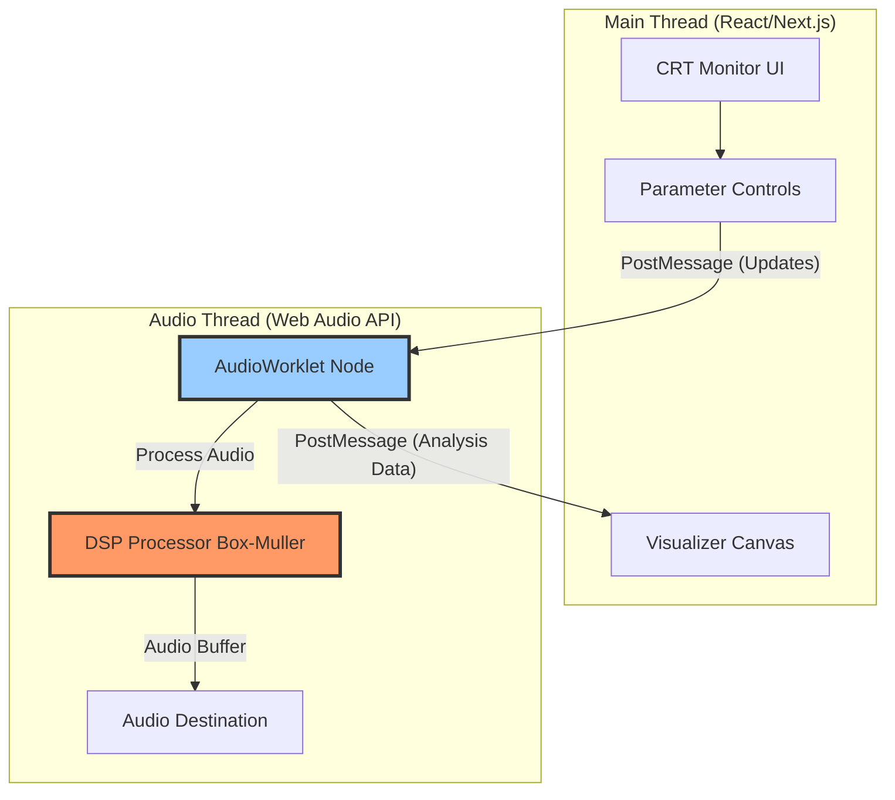
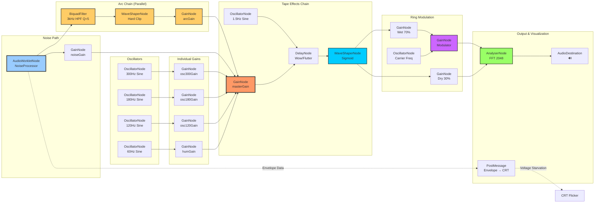
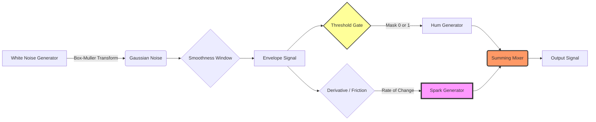

# Blue Rose Signal - Next.js Application

Real-time stochastic interference synthesizer with vintage CRT aesthetic.

**Live Demo**: https://blue-rose-signal-34yzzay5v-tryphons-projects.vercel.app

## Overview

This is a **real-time audio synthesis web application** that generates electrical interference sounds using the Web Audio API. It faithfully recreates the original Python DSP algorithm with live parameter control.

## Tech Stack

- **Framework**: Next.js 16.0.3 (App Router)
- **Language**: TypeScript 5.9.3
- **UI**: React 19.2.0
- **Styling**: Tailwind CSS 4.1.17
- **Audio**: Web Audio API + AudioWorkletProcessor

## Installation

```bash
npm install
```

## Development

```bash
npm run dev
```

Open [http://localhost:3004](http://localhost:3004)

## Production Build

```bash
npm run build
npm start
```

## Project Structure

```text
blue-rose-signal-next/
├── app/
│   ├── page.tsx          # Main UI with parameter controls and preset system
│   ├── layout.tsx        # Root layout with metadata
│   ├── icon.tsx          # Dynamic favicon (pixelated inverted triangle)
│   └── globals.css       # Global styles, CRT effects, VT323 font
├── components/
│   ├── CRTMonitor.tsx    # Responsive vintage TV cabinet wrapper
│   ├── AudioVisualizer.tsx  # Waveform + Spectrogram canvas displays
│   └── VUMeter.tsx       # Real-time RMS level meter
├── lib/
│   ├── liveSynth.ts      # LiveSynthesizer class (main audio engine)
│   ├── presets.ts        # 5 curated sound presets
│   └── dsp.ts           # Legacy WAV generation (no longer used)
├── public/
│   └── noise-processor.js  # AudioWorklet processor (stochastic DSP core)
├── package.json
├── tsconfig.json
├── tailwind.config.ts
├── postcss.config.js
└── next.config.js
```

## Architecture

### Threading Model

The application uses a dual-threaded architecture to ensure glitch-free audio:



**Key Concepts**:
- **Main Thread**: Handles React rendering, user input, and visualization
- **Audio Thread**: Runs AudioWorklet processor at audio rate (~48kHz)
- **PostMessage**: Asynchronous communication between threads (prevents audio dropouts)
- **Zero-Copy**: Audio buffers processed directly in audio thread for minimal latency

### Audio Engine ([lib/liveSynth.ts](lib/liveSynth.ts))

The `LiveSynthesizer` class manages the complete Web Audio signal chain with advanced effects:



**Key Features**:

- All parameters update in real-time with smooth ramping (50ms ramp time)
- OscillatorNodes generate pure sine waves for electrical hum harmonics
- AudioWorkletNode runs custom DSP for stochastic noise generation
- **Voltage Starvation**: Envelope data sent to CRT for brightness modulation
- **Arc Chain**: Parallel spectral processing for electrical "snap" (HPF → Hard Clipper)
- **Tape Effects**: LFO-modulated delay (wow/flutter) + sigmoid saturation
- **Ring Modulation**: Carrier oscillator with dry/wet mixer for spectral effects
- AnalyserNode provides FFT data for visualization

### DSP Core ([public/noise-processor.js](public/noise-processor.js))

The `NoiseProcessor` AudioWorklet implements the stochastic algorithm.

#### Conceptual Signal Flow



**Critical Design**: Sparks flow to the mixer **independently of the gate**, creating the authentic "breaking contact" sound even when the hum is off.

#### Detailed Per-Sample Processing

```mermaid
flowchart TD
    Start([Per-Sample Processing]) --> Uniform[Generate Uniform Noise<br/>rawNoise ~ U0,1]
    Uniform --> Buffer[Add to Moving Avg Buffer<br/>envelopeBuffer.push]
    Buffer --> Window{Buffer > windowSize?}
    Window -->|Yes| Shift[Remove Oldest<br/>envelopeBuffer.shift]
    Window -->|No| Calc
    Shift --> Calc[Calculate Average<br/>envelope = Σ buffer / length]

    Calc --> Gate{envelope > threshold?}
    Gate -->|Yes| Mask1[connectionMask = 1.0]
    Gate -->|No| Mask0[connectionMask = 0.0]

    Mask1 --> ApplyGate[Apply Gate<br/>gatedEnv = mask × envelope]
    Mask0 --> ApplyGate

    Calc --> Diff[Calculate Friction<br/>friction = |env<sub>t</sub> - env<sub>t-1</sub>|]
    Diff --> BoxMuller[Box-Muller Transform<br/>gaussianNoise ~ N0,1]
    BoxMuller --> SparkCalc[spark = gaussian × friction × sparkGain]

    ApplyGate --> Mix[Mix Signals<br/>output = gatedEnv × 0.5 + spark × 0.01]
    SparkCalc --> Mix

    Mix --> Store[Store envelope for next sample<br/>lastEnvelope = envelope]
    Store --> NextSample([Next Sample])

    style Gate fill:#ff9,stroke:#333,stroke-width:2px
    style BoxMuller fill:#9cf,stroke:#333,stroke-width:2px
    style Mix fill:#f96,stroke:#333,stroke-width:3px
```

**Critical Design Choice**: Sparks are NOT multiplied by `connectionMask`. This means they occur even when the hum is "disconnected", creating authentic "breaking contact" transients.

### Parameters

#### LiveSynthParams Interface

```typescript
interface LiveSynthParams {
  // Noise/Spark Controls
  threshold: number      // 0.1-0.9: Connection threshold
  smoothness: number     // 50-2000: Envelope smoothing window
  sparkGain: number      // 0-200: Spark intensity
  noiseGain: number      // 0-1: Overall noise level

  // Hum Controls
  humGain: number        // 0-1: 60Hz fundamental
  hum120Gain: number     // 0-1: 120Hz harmonic
  hum180Gain: number     // 0-1: 180Hz harmonic
  hum300Gain: number     // 0-1: 300Hz harmonic

  // Ring Modulation ("Ghost in the Radio")
  ringModEnabled: boolean  // Enable/disable ring modulation
  carrierFreq: number      // 100-3000Hz: Carrier frequency

  // Tape Effects (Wow/Flutter + Saturation)
  wowFlutterDepth: number  // 0-1: Depth of pitch wobble
  saturation: number       // 0-1: Amount of tape saturation

  // Global
  masterVolume: number   // 0-1: Master output
}
```

**New Effects Added:**

1. **Voltage Starvation (CRT Flicker)**: The audio envelope is transmitted from the AudioWorklet to the main thread every 128 samples (~2.67ms at 48kHz, equivalent to 375fps). This envelope data modulates the CRT monitor's brightness and opacity in real-time, creating a synchronized visual "voltage starvation" effect where the screen dims and brightens with the audio intensity.

2. **Ring Modulation**: A carrier oscillator multiplies the audio signal, creating inharmonic sidebands. When enabled, the signal is split into dry (30%) and wet (70%) paths. The wet path passes through a gain node whose gain value is controlled by the carrier oscillator, implementing true ring modulation. This creates the eerie "ghost in the radio" effect.

3. **Tape Wow/Flutter**: A DelayNode with its delay time modulated by a 1.5Hz LFO creates authentic tape-style pitch wobble. The LFO depth is scaled to 0-2ms of modulation, simulating mechanical imperfections in vintage tape playback.

4. **Tape Saturation**: A WaveShaperNode with a sigmoid transfer curve applies soft clipping to the signal. The curve is generated using a hyperbolic tangent approximation with configurable drive amount (0-50x), creating warm analog-style saturation with progressive harmonic distortion.

### Presets ([lib/presets.ts](lib/presets.ts))

5 curated sonic profiles:

1. **Classic Hum**: Balanced 60Hz drone with subtle crackling
2. **Heavy Crackle**: Aggressive sparks with prominent noise
3. **Ethereal Drone**: Smooth, haunting tone with minimal interference
4. **Unstable Signal**: Chaotic modulation with heavy sparking
5. **Deep Rumble**: Low frequency emphasis with organic fluctuation

### UI Components

#### CRTMonitor ([components/CRTMonitor.tsx](components/CRTMonitor.tsx))

Creates a fully responsive vintage interface with device-specific aesthetics:

**Mobile (< 1024px) - "Handheld Field Recorder"**:

- Minimal thin dark bezel (8px padding, sharp edges)
- Full-width screen utilization (100% viewport width)
- No decorative elements (hidden: wood grain, control knobs, speaker grille, TV legs)
- Clean, functional interface optimized for fieldwork

**Desktop (≥ 1024px) - "Bureau Desk Terminal"**:

- Wood-grain gradient bezel (40px/80px padding)
- Rounded corners with depth shadows
- Scanlines overlay animation
- Phosphor glow effects
- Speaker grille at bottom
- TV stand legs
- Decorative control knobs (Volume, Channel, Brightness)

#### AudioVisualizer ([components/AudioVisualizer.tsx](components/AudioVisualizer.tsx))

Dual canvas visualization:

- **Waveform**: Time-domain display using `getByteTimeDomainData()`
- **Spectrogram**: Frequency-domain display using `getByteFrequencyData()`
- Real-time rendering at 60fps via `requestAnimationFrame`
- Amber phosphor color scheme

#### VUMeter ([components/VUMeter.tsx](components/VUMeter.tsx))

RMS level meter:

- Calculates RMS from frequency data: `sqrt(sum(x²) / N)`
- Gradient bar (amber → red at peak)
- Glow effect using canvas `shadowBlur`
- Tick marks every 10%

## Advanced Effects Implementation

### 1. Voltage Starvation (CRT Flicker)

**Implementation** ([lib/liveSynth.ts:143-148](lib/liveSynth.ts#L143-L148), [public/noise-processor.js:92-101](public/noise-processor.js#L92-L101)):

The voltage starvation effect synchronizes the visual CRT display with the audio envelope, creating an immersive electromechanical aesthetic.

**Audio Thread** (noise-processor.js):
```javascript
// Send envelope data every 128 samples (~2.67ms at 48kHz = 375fps)
this.frameCount++
if (this.frameCount >= this.sendInterval) {
  this.port.postMessage({
    type: 'envelopeUpdate',
    envelope: this.envelope,        // Smoothed envelope (0-1)
    connectionMask: connectionMask  // Binary threshold state
  })
  this.frameCount = 0
}
```

**Main Thread** (liveSynth.ts):
```typescript
// Receive envelope data from audio worklet
this.noiseWorklet.port.onmessage = (event) => {
  if (event.data.type === 'envelopeUpdate' && this.envelopeCallback) {
    this.envelopeCallback(event.data.envelope, event.data.connectionMask)
  }
}
```

**Visual Application** (CRTMonitor.tsx):
```typescript
// Map envelope (0-1) to brightness/opacity range (0.7-1.0)
const voltageStarvation = isPlaying ? 0.7 + (envelope * 0.3) : 1.0

<div style={{
  opacity: voltageStarvation,
  filter: `brightness(${voltageStarvation})`
}}>
```

**Performance**: 375fps update rate ensures smooth visual response without overwhelming React's render cycle.

### 2. Ring Modulation ("Ghost in the Radio")

**Implementation** ([lib/liveSynth.ts:194-230](lib/liveSynth.ts#L194-L230)):

Ring modulation creates inharmonic spectral content by multiplying the audio signal with a carrier oscillator.

**Setup**:
```typescript
// Create carrier oscillator
this.carrierOsc = this.audioContext.createOscillator()
this.carrierOsc.frequency.value = params.carrierFreq // 100-3000Hz
this.carrierOsc.type = 'sine'

// Create modulation gain (carrier controls its gain value)
this.ringModGain = this.audioContext.createGain()
this.ringModGain.gain.value = 0  // Carrier oscillator sets this

// Connect carrier to modulate the gain
this.carrierOsc.connect(this.ringModGain.gain)
this.carrierOsc.start()
```

**Dry/Wet Mixing**:
```typescript
// Create parallel signal paths
this.ringModDry = this.audioContext.createGain()
this.ringModWet = this.audioContext.createGain()

// Route through both paths
this.tapeSaturation.connect(this.ringModDry)  // Bypasses ring mod
this.tapeSaturation.connect(this.ringModWet)  // Goes through ring mod

// Wet path gets modulated
this.ringModWet.connect(this.ringModGain)

// Mix based on enabled state
if (params.ringModEnabled) {
  this.ringModDry.gain.value = 0.3  // 30% dry
  this.ringModWet.gain.value = 0.7  // 70% wet
} else {
  this.ringModDry.gain.value = 1.0  // 100% dry
  this.ringModWet.gain.value = 0.0  // 0% wet
}
```

**Result**: Creates sum and difference frequencies (`f_input ± f_carrier`), producing metallic, robotic timbres characteristic of vintage radio interference.

### 3. Tape Wow/Flutter

**Implementation** ([lib/liveSynth.ts:163-180](lib/liveSynth.ts#L163-L180)):

Simulates mechanical imperfections in tape playback by modulating the delay time with a low-frequency oscillator.

**Setup**:
```typescript
// Create delay node (pitch wobble effect)
this.tapeDelay = this.audioContext.createDelay(0.1)  // Max 100ms
this.tapeDelay.delayTime.value = 0.005  // Base delay: 5ms

// Create LFO (low frequency oscillator)
this.tapeLFO = this.audioContext.createOscillator()
this.tapeLFO.frequency.value = 1.5  // 1.5Hz flutter (typical for tape)
this.tapeLFO.type = 'sine'

// LFO gain controls depth of modulation
this.tapeLFOGain = this.audioContext.createGain()
this.tapeLFOGain.gain.value = params.wowFlutterDepth * 0.002  // 0-2ms modulation

// Connect LFO to modulate delay time
this.tapeLFO.connect(this.tapeLFOGain)
this.tapeLFOGain.connect(this.tapeDelay.delayTime)
this.tapeLFO.start()
```

**Mechanics**:
- **Delay Time Modulation**: `delayTime = 5ms ± (LFO × depth × 2ms)`
- **Pitch Effect**: Changing delay time creates Doppler-like pitch shifting
- **Frequency Range**: 1.5Hz LFO creates ~0.5-3Hz wobble typical of vintage tape

**Psychoacoustic Effect**: Subtle pitch variation adds warmth and organic character, breaking digital sterility.

### 4. Tape Saturation

**Implementation** ([lib/liveSynth.ts:182-185, 378-392](lib/liveSynth.ts#L182-L185)):

Applies nonlinear soft clipping using a WaveShaperNode with a sigmoid transfer curve.

**WaveShaper Setup**:
```typescript
// Create waveshaper with sigmoid curve
this.tapeSaturation = this.audioContext.createWaveShaper()
this.tapeSaturation.curve = this.makeSaturationCurve(params.saturation)
this.tapeSaturation.oversample = '4x'  // High quality (prevents aliasing)
```

**Sigmoid Curve Generation**:
```typescript
private makeSaturationCurve(amount: number): Float32Array {
  const samples = 1024
  const curve = new Float32Array(samples)
  const deg = Math.PI / 180
  const drive = amount * 50  // Scale 0-1 to 0-50 drive intensity

  for (let i = 0; i < samples; i++) {
    const x = (i * 2) / samples - 1  // Range: -1 to 1
    // Hyperbolic tangent approximation (tanh-like soft clipping)
    curve[i] = (Math.exp(drive * x * deg) - Math.exp(-drive * x * deg)) /
                (Math.exp(drive * x * deg) + Math.exp(-drive * x * deg))
  }
  return curve
}
```

**Transfer Function**:
```
y = tanh(drive × x) ≈ (e^(d×x) - e^(-d×x)) / (e^(d×x) + e^(-d×x))

Where:
  - x ∈ [-1, 1]: Input signal
  - d = amount × 50: Drive/saturation intensity
  - y ∈ [-1, 1]: Output signal (soft clipped)
```

**Harmonic Effects**:
- **Low Drive (d < 5)**: Minimal harmonic distortion, slight compression
- **Medium Drive (5 < d < 20)**: Progressive odd harmonics (3rd, 5th, 7th)
- **High Drive (d > 20)**: Heavy saturation, hard limiting behavior

**4x Oversampling**: Prevents aliasing artifacts by processing at 4× sample rate internally.

### 5. High-Voltage Arc Chain (Spectral Processing)

**Implementation** ([lib/liveSynth.ts:187-192, 321-346](lib/liveSynth.ts#L187-L192)):

The arc chain is a **parallel signal path** that emphasizes the electrical "snap" and "crackle" of high-voltage arcs without modifying the core stochastic DSP. It isolates high-frequency transients and applies aggressive nonlinear processing.

**Setup**:
```typescript
// 1. High-Pass Filter: Isolate the "snap" from the "hum"
this.arcFilter = this.audioContext.createBiquadFilter()
this.arcFilter.type = 'highpass'
this.arcFilter.frequency.value = 3000  // Only high frequencies (sizzle)
this.arcFilter.Q.value = 5.0           // High resonance creates "zap" sound

// 2. Hard Clipper: Turn soft Gaussian noise into electrical cracks
this.arcShaper = this.audioContext.createWaveShaper()
this.arcShaper.curve = this.makeHardClipCurve() as Float32Array
this.arcShaper.oversample = '4x'  // Prevent aliasing

// 3. Arc Gain: Control intensity (linked to sparkGain parameter)
this.arcGain = this.audioContext.createGain()
this.arcGain.gain.value = Math.min((params.sparkGain / 200) * 0.5, 0.5)

// Connect parallel path: Worklet → HPF → Hard Clip → Arc Gain → Master
// This bypasses tape effects to keep transients sharp!
this.noiseWorklet.connect(this.arcFilter)
this.arcFilter.connect(this.arcShaper)
this.arcShaper.connect(this.arcGain)
this.arcGain.connect(this.masterGain!)
```

**Hard Clipping Transfer Function**:
```typescript
private makeHardClipCurve(): Float32Array {
  const samples = 1024
  const curve = new Float32Array(samples)

  for (let i = 0; i < samples; i++) {
    const x = (i * 2) / samples - 1  // Range: -1 to 1

    // Hard clipping creates square-wave transients (electrical "snap")
    if (x > 0.5) {
      curve[i] = 1.0       // Clip positive peaks
    } else if (x < -0.5) {
      curve[i] = -1.0      // Clip negative peaks
    } else {
      curve[i] = x * 2     // Steep linear slope in middle
    }
  }
  return curve
}
```

**Physics of Electrical Arcs**:

Real high-voltage electricity sounds "sharp" because:

1. **Ionization**: Air breakdown creates instantaneous square-wave transients
2. **Plasma Resonance**: Ionized gas rings at specific frequencies (high Q)
3. **Broadband Spectral Content**: Square waves contain infinite odd harmonics

**Signal Processing Techniques**:

- **High-Pass Filtering (3kHz)**: Removes low-frequency hum, isolates transient "snap"
- **High Q Resonance (Q=5.0)**: Emphasizes specific frequencies, simulating air ionization "ring"
- **Hard Clipping**: Converts Gaussian noise spikes into square-wave "cracks"
- **Parallel Routing**: Bypasses tape effects to preserve sharp transient attack

**Spectral Result**:

```
Input:  Gaussian spark (soft, rounded waveform)
↓ HPF @ 3kHz, Q=5.0
↓ Hard Clip (±0.5 threshold)
Output: Square-wave arc (sharp, electrical "snap" with high-frequency emphasis)
```

**Parameter Linking**: Arc gain automatically scales with `sparkGain` parameter (0-200), with maximum volume capped at 50% to prevent overwhelming the mix.

### Effects Chain Order

The signal flows through effects in this specific order:

```
Master Gain → Tape Delay (Wow/Flutter) → Tape Saturation → Ring Mod (Dry/Wet) → Analyser → Output
```

**Rationale**:
1. **Tape Delay First**: Pitch modulation before nonlinearity preserves analog character
2. **Saturation Second**: Nonlinear processing creates harmonics from modulated signal
3. **Ring Mod Last**: Spectral effects applied to fully processed signal for maximum impact

## DSP Algorithm Explained

### Box-Muller Transform

To generate Gaussian-distributed noise (matching NumPy's `np.random.normal(0, 1)`):

```javascript
generateGaussianNoise() {
  let u1 = Math.random()
  let u2 = Math.random()
  if (u1 === 0) u1 = 0.0001  // Avoid log(0)
  return Math.sqrt(-2.0 * Math.log(u1)) * Math.cos(2.0 * Math.PI * u2)
}
```

### Moving Average

Implements convolution-style smoothing:

```javascript
envelopeBuffer.push(rawNoise)
if (envelopeBuffer.length > windowSize) {
  envelopeBuffer.shift()
}
envelope = sum(envelopeBuffer) / envelopeBuffer.length
```

Window size: `smoothness / 10`

### Why Ungated Sparks?

Original Python formula:

```python
connection_mask = envelope > threshold
sparks = np.random.normal(0, 1, len(t)) * (friction * spark_gain)
audio = (hum * connection_mask) + sparks  # ← Sparks NOT gated!
```

This creates two distinct states:

- **Connected (mask=1)**: Hum + Sparks
- **Disconnected (mask=0)**: Only Sparks (the "breaking contact" sound)

Without ungated sparks, the signal would be silent during disconnection, losing the organic electrical character.

## Deployment

### Development Server

```bash
npm run dev
# Runs on http://localhost:3004
```

### Production Build

```bash
npm run build
npm start
```

### Vercel Deployment

```bash
npm install -g vercel
vercel
```

The app will be deployed to a permanent URL like `https://blue-rose-signal.vercel.app`

## Browser Compatibility

Requires browsers with support for:

- Web Audio API
- AudioWorklet (Chrome 66+, Firefox 76+, Safari 14.1+)
- ES6+ JavaScript features

**Tested Devices**:

- Desktop: Chrome, Firefox, Safari, Edge (all modern versions)
- Mobile: iOS Safari, Chrome Mobile, Firefox Mobile
- Responsive design optimized for screen widths 320px - 2560px+

## Performance Notes

- AudioWorklet runs on dedicated audio thread (128-sample quantum)
- Sample rate: 48kHz (browser default)
- Latency: ~3ms (typical)
- CPU usage: <5% (single core)

## Known Issues

- Safari may require user gesture to start AudioContext (browser autoplay policy)
- First audio start may have slight delay while AudioWorklet loads

## Responsive Mobile Design

The application features a **mobile-first responsive design** that adapts seamlessly between devices while maintaining the distinctive Federal Bureau of Control aesthetic.

### Implementation Details

**Breakpoint System**: Uses Tailwind's `lg:` prefix (1024px) as the primary breakpoint

- **< 1024px**: Mobile "Handheld Field Recorder" mode
- **≥ 1024px**: Desktop "Bureau Desk Terminal" mode

**Component Changes**:

- **CRTMonitor.tsx**:
  - Dual-layer bezel: Mobile dark gradient (`#1a1a1a → #0d0d0d`) / Desktop wood-grain overlay
  - Conditional rendering: `hidden lg:block` for decorative elements (wood grain, knobs, speaker, legs)
  - Responsive padding: `p-2 lg:p-10 lg:pb-20`
  - Responsive border radius: `rounded-none lg:rounded-2xl`

- **page.tsx**:
  - Adaptive grid layouts: `grid-cols-1 md:grid-cols-2/3`
  - Increased touch targets on mobile: `p-3 md:p-2`, `space-y-2 md:space-y-1`
  - Vertical stacking on mobile for all control groups
  - Larger gaps between controls: `gap-3 md:gap-2`

- **AudioVisualizer.tsx**:
  - Already responsive with `w-full` canvas elements
  - Grid changes from 1 column (mobile) to 2 columns (md:)

**Design Philosophy**: Desktop experience preserved pixel-perfectly while mobile optimizes for usability with thumb-friendly spacing and full-width utilization.

## Future Enhancements

- [ ] WAV file export functionality
- [ ] Custom preset save/load
- [ ] MIDI controller support
- [ ] Additional visualization modes (spectral waterfall, phase scope)

## Credits

**Federal Bureau of Control Proprietary Tech**

*"The owls are not what they seem."*

---

**Version**: 2.0
**License**: ISC
**Built with**: Next.js 16, Web Audio API, TypeScript
